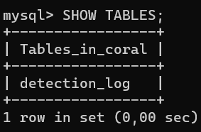
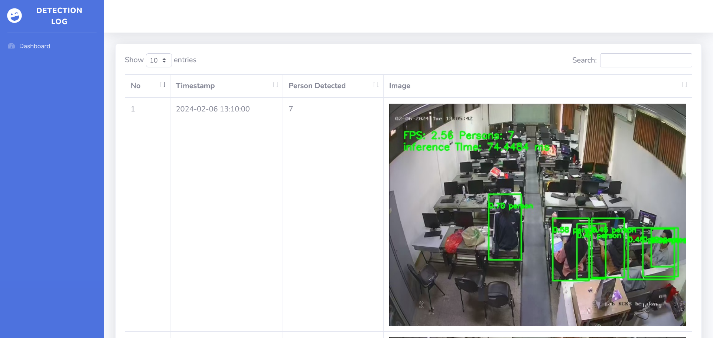

# Google Coral Dev Board Mini Website Inference Log

This website is intended for use in conjunction with the following [repositories](https://github.com/DidaPrasetyo/coral). Please read it before use.

## Setup

This guide requires Apache, PHP and MySQL Database to work. If you haven't installed the three things above, you can follow the following guide for installation based on the OS you are using

- [XAMPP](https://www.apachefriends.org/) for Windows, Linux and Mac OS.
- [WampServer](https://www.wampserver.com/en/) for Windows.
- [LAMP Stack](https://www.digitalocean.com/community/tutorials/how-to-install-linux-apache-mysql-php-lamp-stack-ubuntu-18-04) for Linux.

In this guide, we are using LAMP Stack on Ubuntu 18.04 device. Feel free to use another options available based on your preferences.

## Database Setup

1. Clone this repository
    
    ```
    git clone https://github.com/DidaPrasetyo/coral_log
    ```
    
2. Connect to your MySQL database and create a database with the name `coral`
    
    ```sql
    mysql -u {username} -p
    CREATE DATABASE coral;
    ```
    
3. Create a user with the name `coral`  and leave the password blank and grant all access to the database `coral`
    
    ```sql
    CREATE USER 'coral'@'%' IDENTIFIED BY '';
    GRANT ALL PRIVILEGES ON coral.* TO 'coral'@'%';
    FLUSH PRIVILEGES;
    ```
    
    Using `'@%'` is not recommended as it can open security holes that allow users to access from any IP address.  Instead, it is recommended to explicitly declare the permitted IP addresses, ex: `‘coral’@’10.15.40.161’`, so that only users from 10.15.40.161 IP address can access them. 
    
4. Import the SQL file contained in the database folder from the previously cloned repository
    
    ```sql
    mysql -u coral -p coral
    USE coral;
    SOURCE /path/to/coral_log/database/coral.sql;
    SHOW TABLES;
    ```
    
    The following is the output if the table is successfully imported into the Coral database.
    
    
    

From here, you can continue setting up the implementation of human detection on the Google Coral Dev Board Mini which is in the following [repository](https://github.com/DidaPrasetyo/coral).

## Website Deployment

1. Website deployment depends on the Apache installation used.
    - On LAMP Stack, copy this repository into `/var/www/html`
    - On XAMPP, copy this repository into your `htdocs` folder
    - On WampServer, copy this repository into your `wamp/www` folder
2. Access the website using a browser with the address `http://{ip webserver}/coral_log/` or `http://localhost/coral_log/` if the browser is opened on the same device as the web server
    
    The following is a view of the website
    
    